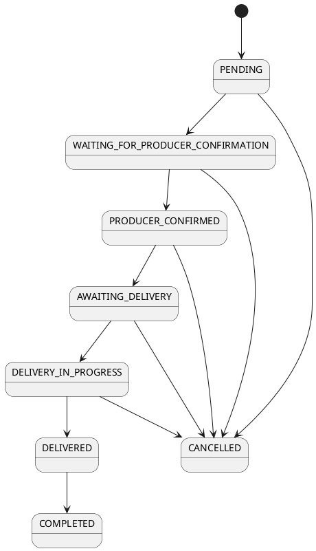

# Values of the enum order.orderStatus

* PENDING: The order has been placed but hasn't been confirmed by the producer yet.
* WAITING_FOR_PRODUCER_CONFIRMATION: The order is awaiting confirmation from the producer.
* PRODUCER_CONFIRMED: The producer has confirmed the order.
* AWAITING_DELIVERY: The order is confirmed and is waiting for the delivery process to begin.
* DELIVERY_IN_PROGRESS: The order is currently being delivered.
* DELIVERED: The order has been successfully delivered to the customer.
* CANCELLED: The order was cancelled either by the customer or the producer.
* COMPLETED: The order is fully processed, including delivery and final confirmation.

